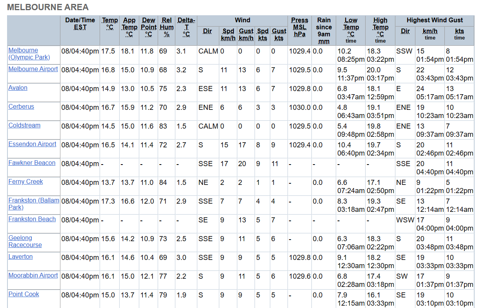
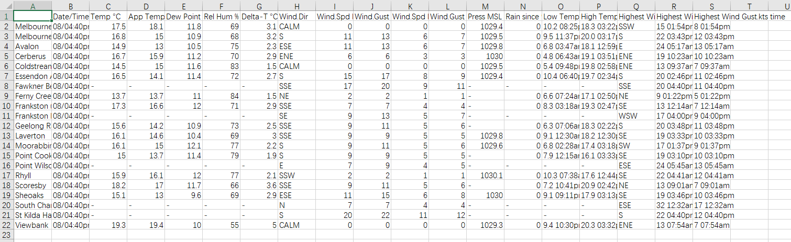

# Melbourne Weather Collector

### Description
The "Melbourne Weather Station Data Parser" is a Python-based automation tool designed to fetch, parse, and store weather data from the Melbourne region. This project targets the official Melbourne weather observation webpage, extracting vital weather metrics such as temperature, humidity, wind speed, and atmospheric pressure at regular intervals.

The main goal of this project is to create a robust dataset that can be used for modeling and analyzing local weather patterns over time. By capturing data at frequent intervals, the tool allows for comprehensive analysis, helping in trend identification, climate research, and potentially enhancing weather prediction models specific to the Melbourne area.

This automated tool is particularly useful for meteorologists, researchers, and data scientists interested in climate studies, providing them with ready-to-use, time-series formatted weather data. The data is saved locally in CSV format, facilitating easy integration with analytical tools and software for further processing and model building.

By ensuring data is consistently updated and stored, this project serves as a foundational element for ongoing weather-related research and applications, aiming to contribute to the broader understanding of climate dynamics in Melbourne.

### Data Source
The data is sourced from the official Bureau of Meteorology's website for Melbourne observations:
[Melbourne Weather Observations](https://reg.bom.gov.au/vic/observations/melbourne.shtml)

### Installation and Usage
1. Install the required Python libraries:
   ```bash
   pip install -r requirements.txt
   ```
2. Run the main script to start data collection:
   ```bash
   python main.py
   ```

This setup will automatically create new directories in the `log` folder for each run, storing the fetched and parsed data at the specified intervals.

### Visual Reference
The images below show the transformation of data from the Melbourne weather observation webpage to a structured CSV format that the script outputs:

- Image 1: Example data from the Melbourne Weather Observations webpage.



- Image 2: The corresponding structured data saved in CSV format.


